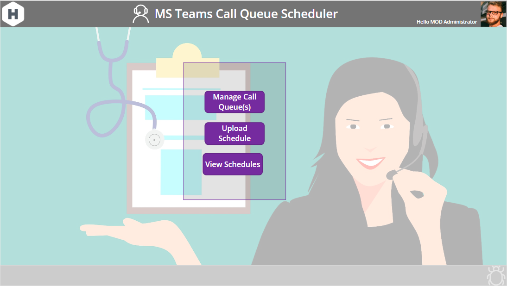
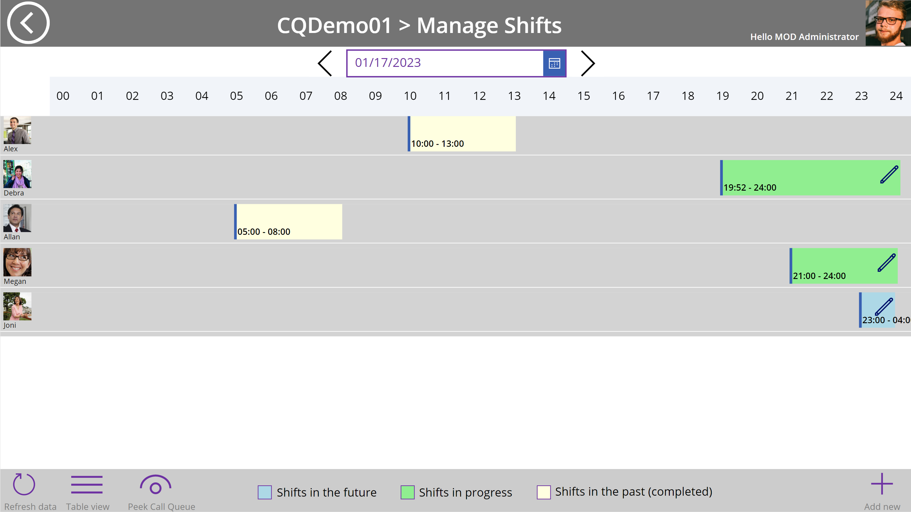

# Microsoft Teams Call Queue Scheduler

| [Solution overview](https://github.com/OfficeDev/microsoft-teams-apps-call-queue-scheduler/wiki/1.-Solution-overview) |[Deployment guide](https://github.com/OfficeDev/microsoft-teams-apps-call-queue-scheduler/wiki/2.-Deployment) | [Configuration guide](https://github.com/OfficeDev/microsoft-teams-apps-call-queue-scheduler/wiki/3.-Configuration) | [FAQ](https://github.com/OfficeDev/microsoft-teams-apps-call-queue-scheduler/wiki/4.-FAQ) | [Support](https://github.com/OfficeDev/microsoft-teams-apps-call-queue-scheduler/blob/main/SUPPORT.md) |
| ---- | ---- | ---- | ---- | ---- |

This application allows a delegated administrator to manage the active agents for a Microsoft Teams Call Queue in real-time and/or through a defined shift schedule.

## About this application

The Teams Admin Center (TAC) and PowerShell are the two admin interfaces to manage Call Queues.  While both allow for an admin to full managability a Call Queue, this application has been developed to fill the following gaps:

* ability to delegate administration of the the agents for a given Call Queue.
* scheduling agents in the Call Queue for specific shifts in the future.

This application provides the following capability:

* Call Queue
    * Select a delegated Call Queue and view the list of named agents that are currently active.
    * Make real-time changes to the list of named agents defined in a Call Queue by a delegated administrator.
    * Schedule agents in shifts to allow for the automation of named agents in the Call Queue by a delegated administrator.
        * Schedule agents in advance by uploading a CSV file.
        * Modify an existing shift schedule
            * add an agent to the existing schedule
            * remove an agent from the existing schedule
            * modify the shift of a scheduled agent.

This application works by manipulating the list of named agents in a Call Queue.  This application does NOT support agents defined as part of a group or a Team channel.  Since this application leverages named agents, the number of agents that can be active in the queue at the same time is limited to 20.  The number of agents that could be potentially added to the queue can be much greater.

The people picker presented in the app shows all the users in your organization. Due to our API limitation we cannot filter the users to show only those with enterprise voice enabled. Adding agents will be successful only if the selecter user(s) are enterprise voice enabled. You will not see any error thrown if the user is not enterprise voice enabled and you attempt to add them as an agent.

See Step 3: Set up who will answer incoming calls [here](https://learn.microsoft.com/en-us/microsoftteams/create-a-phone-system-call-queue#steps-to-create-a-call-queue) for detail on the different ways agents can be defined to answer calls. 

> Note: This is a sample application.  It does not have robust error handling to accomodate all exceptions.  This includes error handling to account for the case where the 21st or greater agent is added to the queue, or to handle situations involving groups or Teams channels.  

The architecture of this solution can be adapted to support other scenarios that require delegated admin management of Teams phone system or any other feature accessible via PowerShell cmdlet or even MS Graph API. 

Here is the application running in Microsoft Teams

<!-- 

    

 -->

If you want to start using the solution yourself review the Wiki for the deployment and configuration steps.

## Cost Estimates
This is a costs estimates based on the public pricelist of January 2023. They do not include the costs for Office 365 & Microsoft Teams.

**All prices are provided for information only.**
| Service  | Estimated usage  | Unit price  | Estimated cost / month  |
|---|---|---|---|
| Power Platform  | 20 admins (Premium connector) | $5 per user/app/month  | $100  |
| Azure App Service plan  | EP1 SKU (1 core, 3.5GB RAM, 250GB storage) | $49.98 per instance/month | $50  |
| Azure (other services)  | storage and keyvault request  | based on capacity (GB) & # requests  | <$1  |
| Total estimated ||| $150 |

- [Power Apps pricing](https://powerapps.microsoft.com/en-us/pricing/)
- [Azure Pricing calculator](https://azure.microsoft.com/en-us/pricing/calculator/)
- [Azure AD pricing](https://azure.microsoft.com/en-us/pricing/details/active-directory/)
- [Azure Functions Premium SKU pricing](https://learn.microsoft.com/en-us/azure/azure-functions/functions-premium-plan?tabs=portal)

## Contributing

This project welcomes contributions and suggestions.  Most contributions require you to agree to a
Contributor License Agreement (CLA) declaring that you have the right to, and actually do, grant us
the rights to use your contribution. For details, visit https://cla.opensource.microsoft.com.

When you submit a pull request, a CLA bot will automatically determine whether you need to provide
a CLA and decorate the PR appropriately (e.g., status check, comment). Simply follow the instructions
provided by the bot. You will only need to do this once across all repos using our CLA.

This project has adopted the [Microsoft Open Source Code of Conduct](https://opensource.microsoft.com/codeofconduct/).
For more information see the [Code of Conduct FAQ](https://opensource.microsoft.com/codeofconduct/faq/) or
contact [opencode@microsoft.com](mailto:opencode@microsoft.com) with any additional questions or comments.

## Trademarks

This project may contain trademarks or logos for projects, products, or services. Authorized use of Microsoft 
trademarks or logos is subject to and must follow 
[Microsoft's Trademark & Brand Guidelines](https://www.microsoft.com/en-us/legal/intellectualproperty/trademarks/usage/general).
Use of Microsoft trademarks or logos in modified versions of this project must not cause confusion or imply Microsoft sponsorship.
Any use of third-party trademarks or logos are subject to those third-party's policies.

## Legal Notice

This app template is provided under the MIT License terms.  In addition to these terms, by using this app template you agree to the following:

* You, not Microsoft, will license the use of your app to users or organization.
* This app template is not intended to substitute your own regulatory due diligence or make you or your app compliant with respect to any applicable regulations, including but not limited to privacy, healthcare, employment, or financial regulations.
* You are responsible for complying with all applicable privacy and security regulations including those related to use, collection and handling of any personal data by your app.  This includes complying with all internal privacy and security policies of your organization if your app is developed to be sideloaded internally within your organization. Where applicable, you may be responsible for data related incidents or data subject requests for data collected through your app.
* Any trademarks or registered trademarks of Microsoft in the United States and/or other countries and logos included in this repository are the property of Microsoft, and the license for this project does not grant you rights to use any Microsoft names, logos or trademarks outside of this repository.  Microsoft’s general trademark guidelines can be found here.
* Use of this template does not guarantee acceptance of your app to the Teams app store.  To make this app available in the Teams app store, you will have to comply with the submission and validation process, and all associated requirements such as including your own privacy statement and terms of use for your app.
